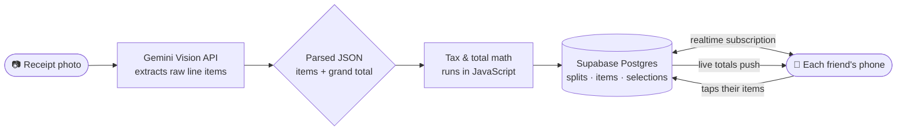

<div align="center">

# 🧾 Smart Splitter

**Snap a photo of a bill, share a link, and watch everyone's share update live.**

Fair group bill splitting — no manual math, no spreadsheets.

[](https://react.dev)
[](https://vite.dev)
[](https://supabase.com)
[](https://ai.google.dev)
[](https://vercel.com)
[](./LICENSE)

### 🔗 [**Try the live app →**](https://smart-splitter-psi.vercel.app)

</div>

---

## ✨ Key features

- 📷 **Scan a receipt, skip the typing** — snap a photo (camera or upload) and Gemini Vision parses the line items and prices automatically.
- 🌐 **Any-language receipts** — items are translated to English during parsing, so a receipt in any script still works.
- 👥 **Real-time group splitting** — everyone opens the same link, taps the items they had, and per-person totals update live on every phone at once.
- 🧮 **Tax done right** — automatically detects whether tax is baked into prices or added at the bottom, and distributes it proportionally either way.
- ✍️ **Manual mode, even *or* uneven** — no receipt? Enter a total and split evenly, or assign custom amounts and let the remainder auto-distribute across everyone else (GPay-style).
- 🔐 **Accounts & groups** — sign in with Google, pick a unique username, and keep recurring groups instead of rebuilding them every dinner.
- 🔎 **Invite by username or link** — search a friend by username to send an in-app invite (Accept / Decline), or share a one-tap join link.
- 🔒 **Finalize & lock** — the split's creator can finalize it so totals are frozen, with a reopen option if something changes.
- 🙋 **"Action required" cues** — members see at a glance which splits still need their input; "nothing here is mine" lets them bow out cleanly.
- 👻 **Guest mode** — scan and split without an account; sign in only when you want groups and invites.
- 📱 **Polished, mobile-first UI** — a custom design system: rounded cards, gradient "pressable" buttons, springy motion, and a live animated background. No UI framework.

## 🛠 Tech stack

| Layer | Technology |
|---|---|
| **Frontend** | React 19 + Vite |
| **Database / Realtime / Auth** | Supabase (PostgreSQL, realtime subscriptions, Google OAuth) |
| **Receipt OCR** | Google Gemini Vision API |
| **Routing** | React Router |
| **Styling** | Custom CSS design system (CSS variables, no UI framework) |
| **Hosting / CI** | Vercel (auto-deploy from `main`) |
| **Version control** | Git / GitHub |

## 🏗 How it works

The core idea is a clean separation of responsibilities: **the AI only reads, the code only computes, and the database only syncs.** Each layer does the one thing it's good at.



Step by step:

1. **Upload** — the user snaps or selects a photo of the receipt.
2. **OCR (AI)** — the image goes to **Gemini Vision**, prompted to return *only* structured JSON: each item's name (translated to English), quantity, unit price, and tax flags, plus the printed grand total. No prose, no math — just extraction.
3. **Reconcile (code)** — JavaScript validates and cleans the JSON, then computes the real per-item and tax figures (see the next section for why this is deliberately *not* the AI's job).
4. **Store** — the split, its items, and each person's selections are written to **Supabase Postgres**.
5. **Share & sync** — a shareable link opens the split for the whole group. Supabase **realtime subscriptions** push every change to every connected device, so as people claim items, everyone's running total updates live without a refresh.

## 🔍 Notable engineering decisions

**1. Keeping arithmetic out of the AI — on purpose.**
LLMs are strong at reading messy, multi-language receipts but unreliable at arithmetic. So Gemini is *only* ever asked to extract raw numbers — never to total anything. The actual money math lives in a plain JavaScript routine (`calculateFinalPrices` in [`src/billparser.js`](./src/billparser.js)): it sums the raw item prices and compares them to the printed grand total. If they already match within a small tolerance, tax is clearly baked into the prices and is left alone. If they don't, the difference *is* the tax, and it's distributed back across items proportionally. The result: the bill math is deterministic and always adds up, regardless of how the model phrased its answer.

**2. Real-time collaboration with no custom backend.**
The "everyone's totals update at once" behavior isn't a hand-rolled WebSocket server or a polling loop — it's built directly on Supabase's Postgres realtime subscriptions. The database is the single source of truth, and the UI just reacts to row changes. Less code to maintain, fewer moving parts to break.

**3. A design system instead of scattered styles.**
The UI is built on one set of CSS variables and reusable component classes — buttons, cards, inputs, badges. The whole app can be re-themed by changing a single accent token, and motion is centralized so it stays consistent (and respects `prefers-reduced-motion` for accessibility). The result feels like a designed product, not a prototype, without pulling in a UI library.

**4. Shipping in versioned increments.**
Each feature set — AI parsing, then real-time splitting, then auth/groups/invites, then the UI overhaul — was built and stabilized before merging to `main`, which auto-deploys to Vercel. Stable versions are kept as backup branches so a release can always be rolled back.

## ⚙️ Running locally

```bash
git clone https://github.com/yogeshwaranbaskaran/smart-splitter.git
cd smart-splitter
npm install
```

Create a `.env` file in the project root with your Gemini key:

```env
VITE_GEMINI_API_KEY=your_gemini_api_key
```

> Supabase connection details currently live in [`src/supabase.js`](./src/supabase.js). Drop in your own project URL and **anon** key there. (The anon key is safe to expose client-side — access is governed by Row Level Security — but moving it to an env var is a planned improvement.)

Then start the dev server:

```bash
npm run dev
```

You'll also need a [Supabase](https://supabase.com) project with tables for `profiles`, `splits`, `items`, `selections`, `groups`, and `group_members`, realtime enabled on those tables, and Google OAuth configured as an auth provider.

## 🗺 Roadmap

The longer-term goal is to grow this from "split a bill" into a small personal-finance tool with three views:

- ✅ **Splits** — *live.* Receipt scanning, real-time group splitting, groups, invites, manual splits, finalize/lock.
- 🔜 **Expenses** — auto-import from past splits plus parsed transaction emails/messages, with one-tap confirmation instead of manual entry.
- 🔜 **Wallet** — a single view of accounts, cards, cash, and who-owes-who across friends.


Splitwise tracks social splits but not your overall spending; budgeting apps do the reverse. The aim is to do both in one place.

## 🤖 How this was built

I built this with AI coding assistants (LLMs) as a pair-programmer — for writing code, debugging, and learning as I went. What I owned myself: the product and architecture decisions, wiring the pieces together, fixing what broke, and every deployment. I'm doing this to genuinely understand how a full-stack app is built end to end, not to claim I typed every line from scratch. Being upfront about that matters to me.


---

<div align="center">

Built as a hands-on way to learn full-stack development end to end — AI integration, real-time databases, OAuth, design systems, and a deployment pipeline.

Feedback and contributions welcome.

</div>
